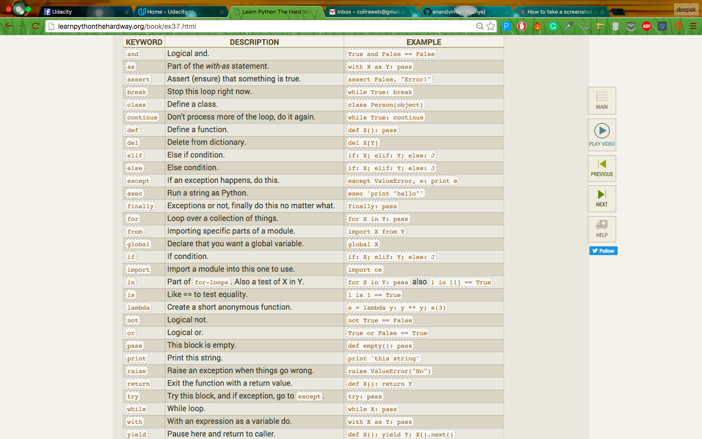
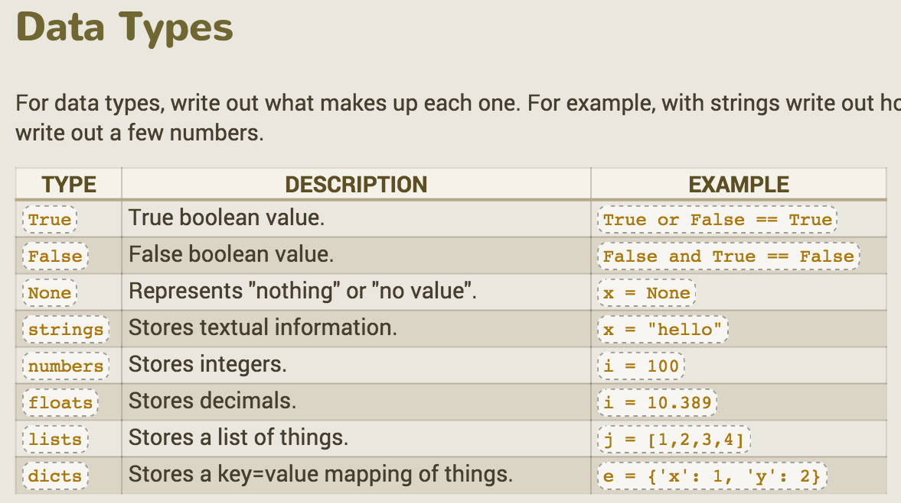
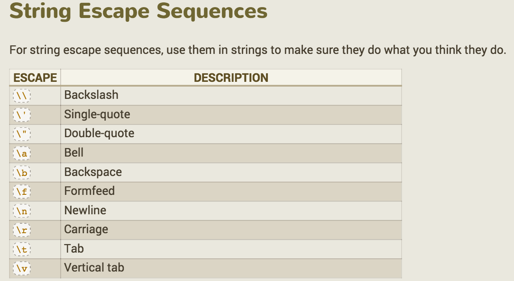
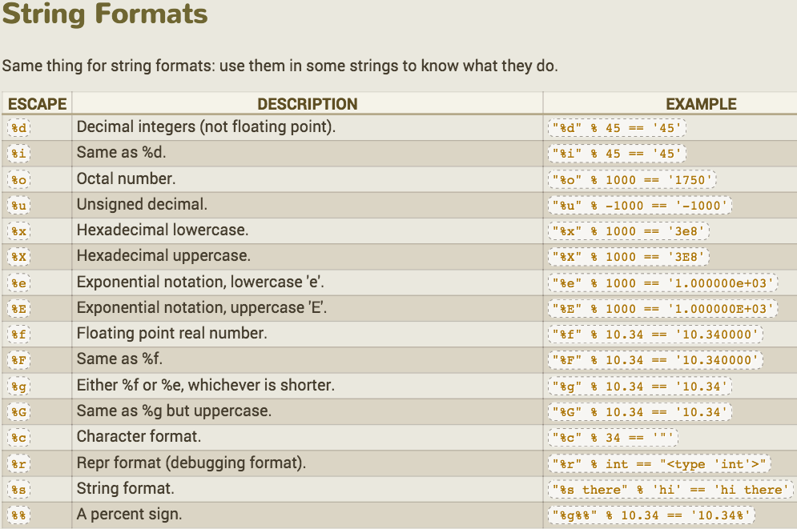

# learn_python_the_hard_way

# ex1:

the keyword # makes makes a comment.

# ex2:
'#' is called pound and is single line comment.

for multiple lines start each line with #.

# ex3:
mod -> % (not percentage)
also this syntax works:
print "hens", 2+2, 2<3, (9+1)/7, 4%2
gives: hens 4 True 1 0

also if one of number is in floats eg 1.0 or 1.11 then whole calculation is done in floats. other wise its in integers.

order of operations: PEMDAS -> parentheses exponents multiplication division addition

# ex4&5:

learn about string formatting here:
https://docs.python.org/2/tutorial/inputoutput.html#fancier-output-formatting

difference between %s and %r:
http://stackoverflow.com/questions/1436703/difference-between-str-and-repr-in-python

# ex10:

ESCAPE Sequences

ESCAPE :	WHAT IT DOES.
```
\\	Backslash (\)
\'	Single-quote (')
\"	Double-quote (")
\a	ASCII bell (BEL)
\b	ASCII backspace (BS)
\f	ASCII formfeed (FF)
\n	ASCII linefeed (LF)
\N{name} :	Character named name in the Unicode database (Unicode only)
\r	Carriage Return (CR)
\t	Horizontal Tab (TAB)
\uxxxx :	Character with 16-bit hex value xxxx (Unicode only)
\Uxxxxxxxx :	Character with 32-bit hex value xxxxxxxx (Unicode only)
\v :	ASCII vertical tab (VT)
\ooo :	Character with octal value ooo
\xhh :	Character with hex value hh
```

# ex11:

ask inputs with : raw_input()
for example:

```
print "Enter your name:"
name = raw_input()
```

avoid using input() instead use raw_input()

# ex12:


# ex15:
get a filename in arguments
and then open a file like this:
```
txt = open(filename)
#to print the file do:
print txt.read()
```
on closing a file read:
http://www.tutorialspoint.com/python/file_close.htm
basically its good practice to close a file once we are done with it.
This way there will be no more changing with files accidently even if the
file object is called.
http://www.tutorialspoint.com/python/file_close.htm

# ex16:
```
raw_input("?")
```
so the ? shows while getting input.
to open a file and to write in it. use w as second argument.
```
target = open(filename, 'w')
target.truncate()
```
truncate erases the whole file.

now the file is empty you can start writing in it again line by line as:
```
target.write("new line in the file")
target.write("2nd line in the file ")
target.close()
```
and to save properly close the file by .close()

```
r --> for reading a file
w --> for writing a file
a --> for append

open(filename)
here r is automatically assumed.

w+,r+,a+ --> does read and write. + is the modifier.
```

# ex17:
```
from os.path import exists
check = exists(filename)
```
check can have vale true or false depending of weather the filename exists or not.
So Basically its a check if file exists or not.
Needs to imported as shown.

# ex18:
fucntions are defined with def keyword. passed arguments and then called in scripts:

```
def fun1(arg1, arg2)
  return arg1 + arg2

def fun2(*args):
  arg1, arg2 = args
  return arg1+arg2

  //in fun2 we need to args to passed as while unpacking it needs exactly 2 args

def fun3(*args):
  print args

  // fun3 can have as many args as needed as it does not unpack them rather deals with args alltogether.
```

# ex24:
this works:
```
def fun1():
  return a,b,c

balls, apples, bullets = fun1()
```

# ex25:

string.split(' ')
split the string into a array with ' ' as splitting points.

sorted(arr)
sorts the list. (list of strings, numbers, etc)

arr.pop()
arr.pop(-1)
ejects last element in list

arr.pop(0)
ejects first element in list

# ex26:
```
and
or
not
!= (not equal)
== (equal)
>= (greater-than-equal)
<= (less-than-equal)
True
False
```

# ex 29 & 30:
```
if people < cats:
  //do something...
elif cars < people:
  // do other thing
else:
  //just do this
```

# ex 32:
for loops:
```
list = [1,2,3,'this', 'abc']

for i in list:
  print i

for i in range(0,10):
  print i
```

while loops
```
i=0

while i<6:
  print i
  i+=1
```

list append:
```
i=0
nums = []
while i<6:
  print i
  i+=1
  nums.append(i)
```

# check python debugger also.
# use if statements and print for debugging.
# debugger can be complex for simple debugging tasts.
# As you get a load of info which you might not need all the time.

# ex37
# Keywords

# datatypes

# String Escape Sequences

# String Formats


# Operators:
```
+	Addition	2 + 4 == 6
-	Subtraction	2 - 4 == -2
*	Multiplication	2 * 4 == 8
**	Power of	2 ** 4 == 16
/	Division	2 / 4.0 == 0.5
//	Floor division	2 // 4.0 == 0.0
%	String interpolate or modulus	2 % 4 == 2
<	Less than	4 < 4 == False
>	Greater than	4 > 4 == False
<=	Less than equal	4 <= 4 == True
>=	Greater than equal	4 >= 4 == True
==	Equal	4 == 5 == False
!=	Not equal	4 != 5 == True
<>	Not equal	4 <> 5 == True
( )	Parenthesis	len('hi') == 2
[ ]	List brackets	[1,3,4]
{ }	Dict curly braces	{'x': 5, 'y': 10}
@	At (decorators)	@classmethod
,	Comma	range(0, 10)
:	Colon	def X():
.	Dot	self.x = 10
=	Assign equal	x = 10
;	semi-colon	print "hi"; print "there"
+=	Add and assign	x = 1; x += 2
-=	Subtract and assign	x = 1; x -= 2
*=	Multiply and assign	x = 1; x *= 2
/=	Divide and assign	x = 1; x /= 2
//=	Floor divide and assign	x = 1; x //= 2
%=	Modulus assign	x = 1; x %= 2
**=	Power assign	x = 1; x **= 2
```

# ex38
```
len("a") gives 1

arr = [1]
len( arr ) gives 1

arr=[1,2,3,4,5,6]

arr[0] gives 1
arr[1] gives second element 2

arr[-1] gives the last element ie 6
arr[-2] gives second last element ie 5

arr=['a','b','c','d','e','f','g','h']
print " ".join(arr)

print " ".join(arr[2:3])
// gives c. it will take from 2 and onwards everything before 3

*if arr is list of strings then it can be joined with join.
```

# ex 39
Dictionaries
```
stuff = {'name': 'Zed', 'age': 39, 'height': 6 * 12 + 2}

# create a mapping of state to abbreviation
states = {
    'Oregon': 'OR',
    'Florida': 'FL',
    'California': 'CA',
    'New York': 'NY',
    'Michigan': 'MI'
}

# create a basic set of states and some cities in them
cities = {
    'CA': 'San Francisco',
    'MI': 'Detroit',
    'FL': 'Jacksonville'
}

# add some more cities
cities['NY'] = 'New York'
cities['OR'] = 'Portland'

for state, abbrev in states.items():
    print "%s is abbreviated %s" % (state, abbrev)

# print every city in state
print '-' * 10
for abbrev, city in cities.items():
    print "%s has the city %s" % (abbrev, city)
```

.items() on a dictionary
```
dict.items()
This method returns a list of tuple pairs.

dict = {'Name': 'Zara', 'Age': 7}

print "Value : %s" %  dict.items()
When we run above program, it produces following result −

Value : [('Age', 7), ('Name', 'Zara')]
```

need more on this page: http://learnpythonthehardway.org/book/ex39.html
can study how dictionaries are made.

---

# ex41

http://learnpythonthehardway.org/book/ex41.html
make sure to do the reading test later on this page.

# ex42
